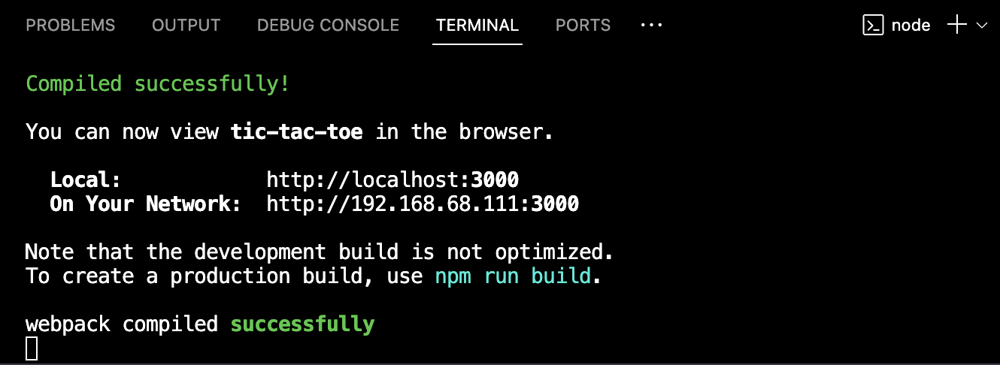
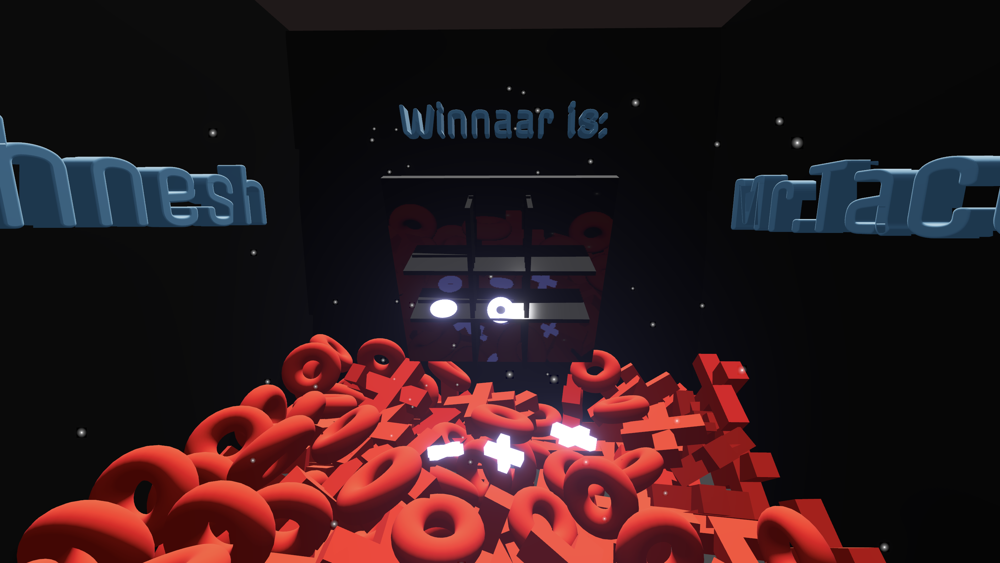

# 3D Tic Tac Toe

Welkom bij mijn unieke versie van Tic Tac Toe, gebracht in een 3-dimensionale ervaring! Dit spel is ontwikkeld met behulp van React, Three.js en Fiber om een frisse draai te geven aan het klassieke spel.

## Lokale Installatie

Volg deze eenvoudige stappen om het spel lokaal te starten:

1. Kloon de repository naar je lokale omgeving:

    ```bash
    git clone [repo]
    ```

2. Navigeer naar de gekloonde map:

    ```bash
    cd [repo]
    ```

3. Installeer de benodigde afhankelijkheden:

    ```bash
    npm install
    ```

4. Start de ontwikkelingsserver:

    ```bash
    npm run dev
    ```

## Terminal Screenshot 



## Gameplay Screenshot


